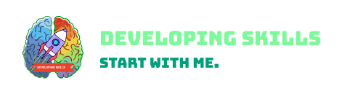
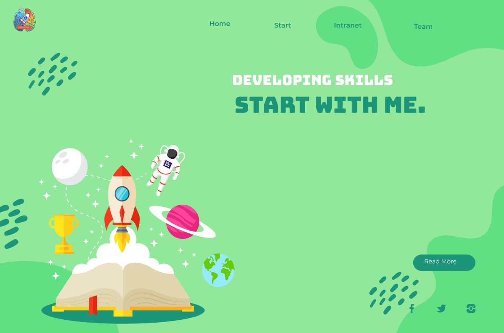
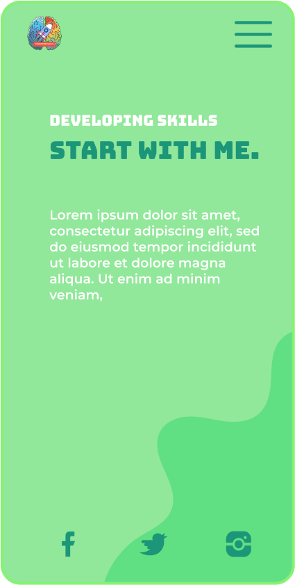
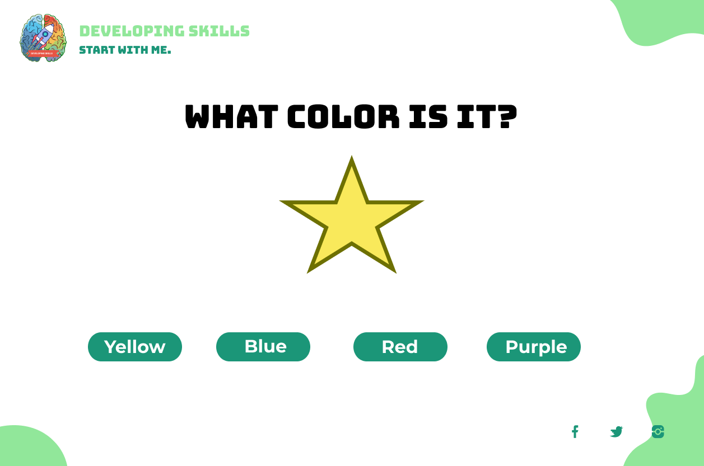
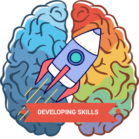

# 
 DEVELOPING SKILLS

Developing skills is the final work or project that we present at the culmination of our time at this academy, below we expose why developing skills and motivating us to continue with the project supporting inclusion.

### 
 START WITH ME.

 Developing skills is a website that aims to improve the cognitive and learning skills of the population with mild intellectual disabilities and Down syndrome in the absence of appropriate step-by-step educational content for that population.

 The population with intellectual disabilities requires directed processes that allow them to understand and appropriate the content directly.

 It is a relevant project to guarantee increasingly inclusive spaces in society through technology, but it depends on a specific population for which it was designed, what is sought with the content is to contribute to cognitive processes that benefit the mentioned population, developing levels of autonomy and independence to lead their learning process through the use of the application.

_“Technology is the new fire, it can extend the lives of some and transform the dreams of others, but we are not talking about any technology, but rather an assistive technology that fulfills a specific function and that provides solutions to the specific needs of people. , in this case people with disabilities. "Rodríguez Johan, voices Technology and disability._

## 
 TO WHOM IS THE PROJECT DIRECTED?

 This project will help reinforce and develop skills in this population, accompanying educational institutions, foundations and families in the learning processes. In addition, it has direct and indirect users. The direct ones are the population with mild intellectual disability and Down's syndrome (cognitive disability), and indirect but fundamental to guide the process.
 families, caregivers, teachers, assistants and those responsible for the processes of these people.

### 
 TECHNOLOGIES

* CSS
* JAVASCRIPT
* HTML
* VUE JS     

## 
 MOCKUP

### WEB

### APP

### DASHBOARD

### LOGO

# 
AUTHORS
- Julian Castañeda
    - Twitter: [@Castaedajulian]
    - Github: [@juliancastaeda]
- Lina María Montaño Ramírez
    - Twitter: [@calypsobronte]
    - Github: [@calypsobronte]

## License
[MIT]

<!-- links -->
[@Castaedajulian]: https://twitter.com/Castaedajulian
[@calypsobronte]: https://twitter.com/calypsobronte
[@juliancastaeda]: https://github.com/juliancastaeda
[@calypsobronte]: https://github.com/calypsobronte
[MIT]: https://github.com/calypsobronte/developingskills/blob/master/LICENSE
